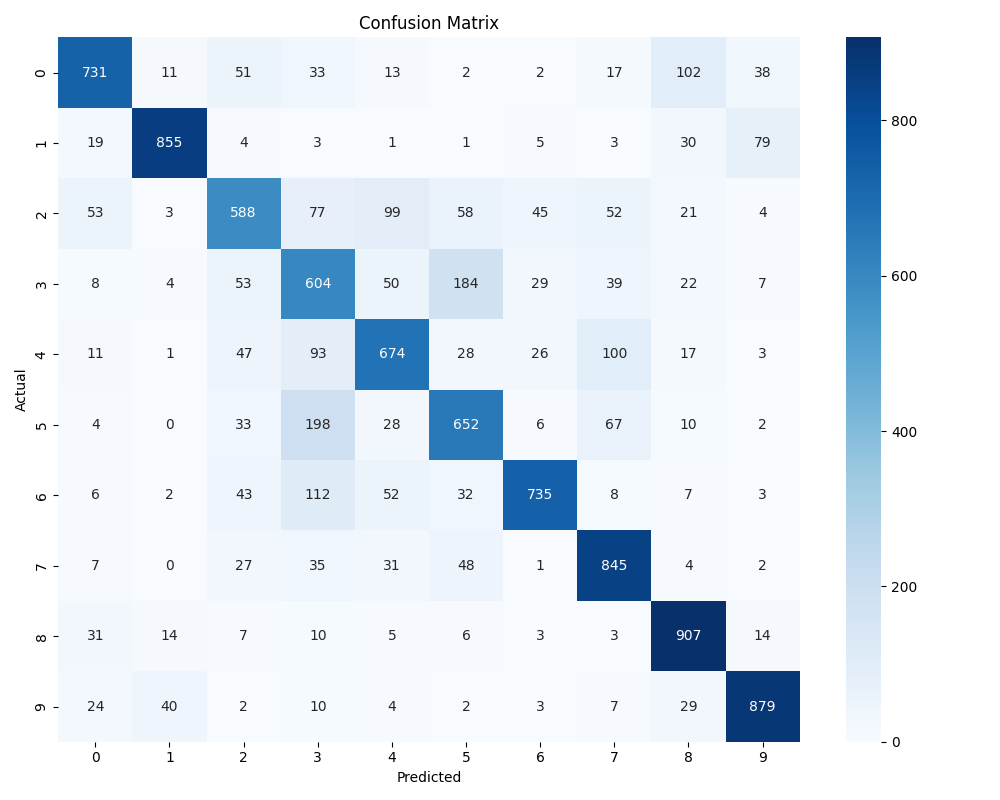
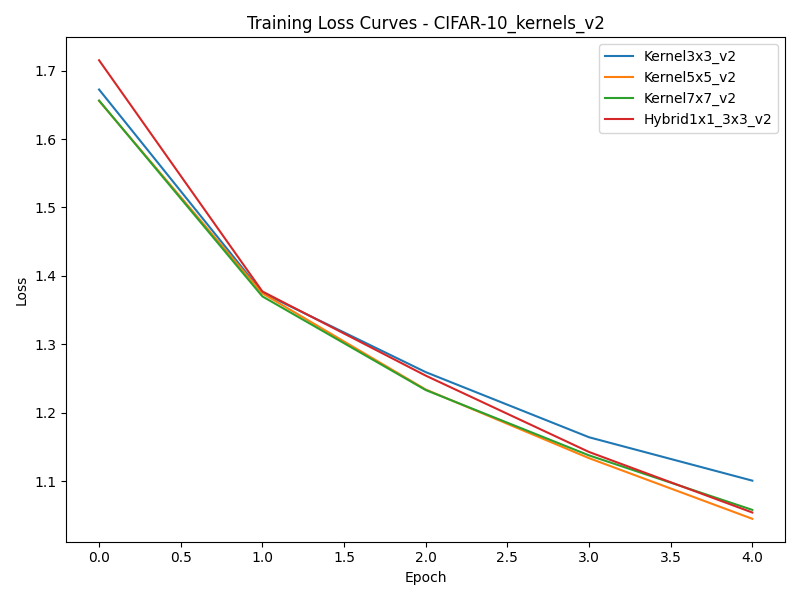
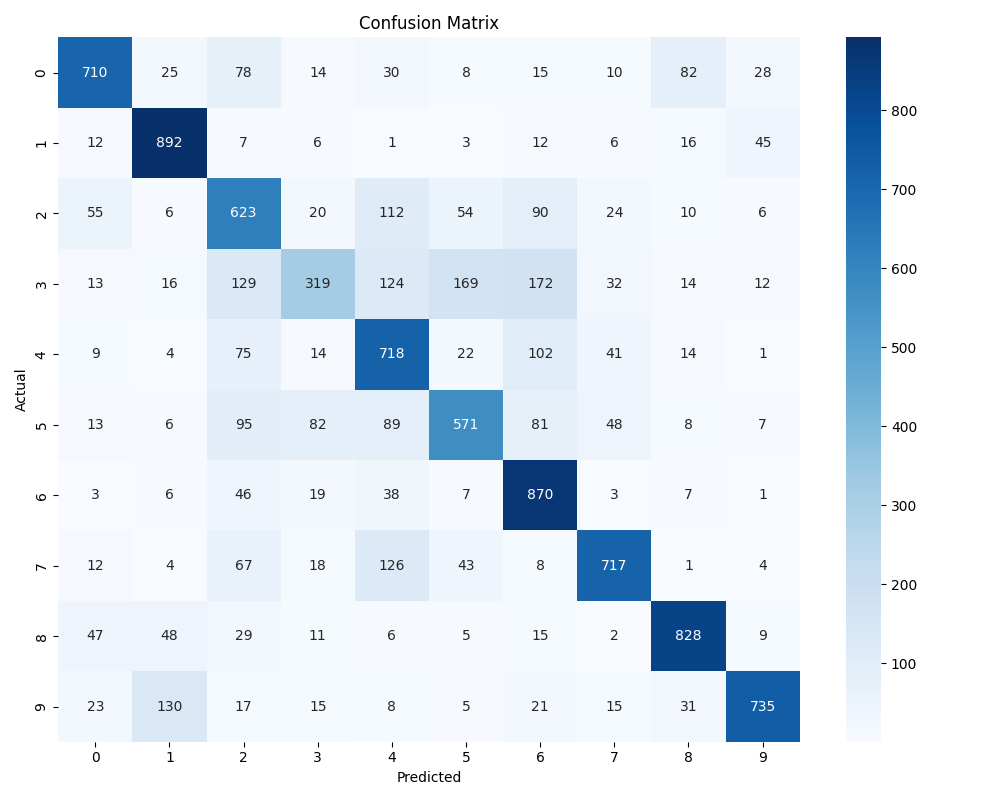

# ДОМАШНЯЯ РАБОТА №4

## Задание 1: Сравнение CNN и полносвязных сетей

## 1. Описание моделей

Сравнивались следующие архитектуры нейронных сетей:

- **FullyConnectedNet** — полносвязная сеть
- **SimpleCNN** — базовая сверточная сеть (только для MNIST)
- **CNNWithResidual** — сверточная сеть с Residual-блоками
- **CNNWithResidualAndRegularization** — та же архитектура с дополнительной регуляризацией (только для CIFAR-10)

---

## 2. Эксперименты на MNIST

### График потерь:

### Матрицы ошибок:

<table>
  <tr>
    <td>FullyConnectedNet</td>
    <td>CNNWithResidual</td>
    <td>SimpleCNN</td>
  </tr>
  <tr>
    <td></td>
    <td></td>
    <td></td>
  </tr>
</table>

### Сравнительная таблица:

| Модель              | Точность | Параметров | Время обучения (с) | Время предсказания (с) | Средний градиент |
|---------------------|----------|------------|---------------------|-------------------------|------------------|
| FullyConnectedNet   | 0.9776   | 535 818    | 17.26               | 0.5391                  | 0.001612         |
| CNNWithResidual     | 0.9931   | 243 658    | 21.46               | 0.4876                  | 0.000134         |
| SimpleCNN           | 0.9857   | 71 754     | 22.49               | 0.5461                  | 0.006547         |

### Выводы:

- **CNNWithResidual** достигает наилучшей точности (99.31%) и демонстрирует стабильное обучение с минимальным средним градиентом.
- **SimpleCNN** имеет наименьшее число параметров, но при этом почти догоняет по точности, что делает её эффективной в условиях ограниченных ресурсов.
- **FullyConnectedNet** заметно уступает по качеству при сопоставимом времени обучения и существенно большем количестве параметров.

---

## 3. Эксперименты на CIFAR-10

### График потерь:

### Матрицы ошибок:

<table>
  <tr>
    <td>FullyConnectedNet</td>
    <td>CNNWithResidual</td>
    <td>CNNWithResidualAndRegularization</td>
  </tr>
  <tr>
    <td></td>
    <td></td>
    <td></td>
  </tr>
</table>

### Сравнительная таблица:

| Модель                            | Точность | Параметров | Время обучения (с) | Время предсказания (с) | Средний градиент |
|-----------------------------------|----------|------------|---------------------|-------------------------|------------------|
| FullyConnectedNet                 | 0.5255   | 1 707 274  | 31.42               | 1.0421                  | 0.013972         |
| CNNWithResidual                   | 0.7691   | 244 234    | 35.24               | 0.9832                  | 0.051276         |
| CNNWithResidualAndRegularization | 0.7447   | 244 426    | 35.50               | 1.0087                  | 0.014404         |

### Выводы:

- **CNNWithResidual** лидирует по точности (76.91%) и демонстрирует высокую устойчивость обучения, несмотря на компактную архитектуру.
- **FullyConnectedNet** существенно уступает сверточным архитектурам по всем параметрам.
- **Регуляризация** уменьшает переобучение (умеренные градиенты), но замедляет сходимость и немного снижает итоговую точность.

---

## 4. Общий анализ

- **Полносвязные сети** быстро теряют эффективность на сложных задачах.
- **Сверточные архитектуры**, особенно с residual-блоками, показывают лучшую точность и эффективность.
- **Регуляризация** помогает контролировать переобучение, но может повлиять на скорость и итог.
- **Матрицы ошибок** позволяют выявить, какие классы чаще всего путаются.
- **Анализ градиентов** — полезный инструмент для оценки качества обучения и выявления потенциальных проблем (взрыв или затухание градиентов).

---

## Задание 2: Анализ архитектур CNN

## 1. Эксперименты с размером ядра свёртки на MNIST

### Описание:

В этом эксперименте мы сравнивали производительность моделей с различными размерами ядер свёртки:

- **Kernel3x3_v2** — ядро 3x3
- **Kernel5x5_v2** — ядро 5x5
- **Kernel7x7_v2** — ядро 7x7
- **Hybrid1x1_3x3_v2** — гибридное ядро из 1x1 и 3x3 свёрток

Каждая модель обучалась 5 эпох на MNIST.

### Результаты:

#### График потерь и обучающих кривых:

#### Матрицы ошибок:

<table>
  <tr>
    <td></td>
    <td></td>
    <td></td>
    <td></td>
  </tr>
  <tr>
    <td>Kernel3x3_v2</td>
    <td>Kernel5x5_v2</td>
    <td>Kernel7x7_v2</td>
    <td>Hybrid1x1_3x3_v2</td>
  </tr>
</table>

#### Сравнительная таблица:

| Модель             | Точность | Параметров | Время обучения (с) | Время предсказания (с) |
|--------------------|----------|------------|--------------------|------------------------|
| Kernel3x3_v2       | 0.9836   | 71 754     | 19.55              | 0.5522                 |
| Kernel5x5_v2       | 0.9860   | 80 202     | 23.50              | 0.5318                 |
| Kernel7x7_v2       | 0.9908   | 92 874     | 23.84              | 0.5747                 |
| Hybrid1x1_3x3_v2   | 0.9841   | 176 202    | 28.67              | 0.5628                 |

### Выводы:

- Модель с ядром 7x7 (**Kernel7x7_v2**) показала наилучшее качество классификации — 99.08%.
- Рост размера ядра увеличивает количество параметров и время обучения, но улучшает точность.
- Гибридная модель (**Hybrid1x1_3x3_v2**) имеет наибольшее число параметров и время обучения, но по точности уступает Kernel7x7_v2.
- Модель с ядром 3x3 — самая лёгкая и быстрая, но уступает в точности.

---

## 2. Эксперименты с глубиной сети на MNIST

### Описание:

Сравнивались четыре архитектуры разной глубины:

- **ShallowCNN_v2** — мелкая сеть
- **MediumCNN_v2** — средняя глубина
- **DeepCNN_v2** — глубокая сеть
- **CNNWithResidual_v2** — глубокая сеть с Residual-блоками

Каждая модель обучалась 5 эпох.

### Результаты:

#### График потерь и обучающих кривых:

#### Матрицы ошибок:

<table>
  <tr>
    <td></td>
    <td></td>
    <td></td>
    <td></td>
  </tr>
  <tr>
    <td>ShallowCNN_v2</td>
    <td>MediumCNN_v2</td>
    <td>DeepCNN_v2</td>
    <td>CNNWithResidual_v2</td>
  </tr>
</table>

#### Сравнительная таблица:

| Модель             | Точность | Параметров | Время обучения (с) | Время предсказания (с) |
|--------------------|----------|------------|--------------------|------------------------|
| ShallowCNN_v2      | 0.9863   | 151 306    | 23.43              | 0.5206                 |
| MediumCNN_v2       | 0.9897   | 197 482    | 20.21              | 0.4804                 |
| DeepCNN_v2         | 0.9902   | 549 994    | 36.92              | 0.5831                 |
| CNNWithResidual_v2 | 0.9905   | 243 658    | 23.04              | 0.5037                 |

### Выводы:

- **CNNWithResidual_v2** показывает лучшую точность (99.05%) с оптимальным соотношением параметров и времени обучения.
- Глубокая сеть **DeepCNN_v2** обладает самым большим числом параметров и временем обучения, но лишь немного превосходит по точности средние по глубине модели.
- Модель средней глубины **MediumCNN_v2** достигает хорошего баланса между скоростью и точностью.
- Мелкая сеть уступает в точности, но быстрее по времени предсказания.

---

## 3. Эксперименты с размером ядра на CIFAR-10

### Описание:

Проводились те же эксперименты с ядрами 3x3, 5x5, 7x7 и гибридной свёрткой для CIFAR-10.

### Результаты:

#### График потерь и обучающих кривых:

#### Матрицы ошибок:

<table>
  <tr>
    <td></td>
    <td></td>
    <td></td>
    <td></td>
  </tr>
  <tr>
    <td>Kernel3x3_v2</td>
    <td>Kernel5x5_v2</td>
    <td>Kernel7x7_v2</td>
    <td>Hybrid1x1_3x3_v2</td>
  </tr>
</table>

#### Сравнительная таблица:

| Модель             | Точность | Параметров | Время обучения (с) | Время предсказания (с) |
|--------------------|----------|------------|--------------------|------------------------|
| Kernel3x3_v2       | 0.6211   | 72 042     | 26.71              | 0.7820                 |
| Kernel5x5_v2       | 0.6144   | 81 002     | 28.22              | 0.7855                 |
| Kernel7x7_v2       | 0.6196   | 94 442     | 28.86              | 0.8060                 |
| Hybrid1x1_3x3_v2   | 0.6095   | 176 234    | 23.31              | 0.6389                 |

### Выводы:

- Все модели показывают относительно низкую точность на CIFAR-10, не превышающую 62.11%.
- Kernel3x3_v2 показывает чуть лучшее качество с меньшим числом параметров и временем обучения.
- Гибридная модель занимает наибольшие ресурсы и время, но имеет худшую точность.
- Размер ядра свёртки не даёт сильного преимущества на CIFAR-10 при данных архитектурах.

---

## 4. Эксперименты с глубиной сети на CIFAR-10

### Описание:

Сравнивались следующие архитектуры разной глубины:

- **ShallowCNN_v2**
- **MediumCNN_v2**
- **DeepCNN_v2**
- **CNNWithResidual_v2**

### Результаты:

#### График потерь и обучающих кривых:

#### Матрицы ошибок:

<table>
  <tr>
    <td></td>
    <td></td>
    <td></td>
    <td></td>
  </tr>
  <tr>
    <td>ShallowCNN_v2</td>
    <td>MediumCNN_v2</td>
    <td>DeepCNN_v2</td>
    <td>CNNWithResidual_v2</td>
  </tr>
</table>

#### Сравнительная таблица:

| Модель             | Точность | Параметров | Время обучения (с) | Время предсказания (с) |
|--------------------|----------|------------|--------------------|------------------------|
| ShallowCNN_v2      | 0.6505   | 151 882    | 28.30              | 0.8066                 |
| MediumCNN_v2       | 0.6983   | 198 058    | 21.41              | 0.6083                 |
| DeepCNN_v2         | 0.7143   | 550 570    | 42.09              | 0.8327                 |
| CNNWithResidual_v2 | 0.7367   | 244 234    | 25.12              | 0.6624                 |

### Выводы:

- Глубокая сеть с Residual-блоками (**CNNWithResidual_v2**) показала наилучшее качество — 73.67%, что значительно лучше остальных моделей.
- Глубокая модель **DeepCNN_v2** также показала высокий результат, но требует больше ресурсов и времени.
- Модель средней глубины быстрее обучается и занимает меньше памяти, чем глубокие модели, при умеренном качестве.
- Мелкая сеть уступает по точности, но самая быстрая.

---

## Общие выводы:

- На MNIST увеличение размера ядра свёртки улучшает качество, но увеличивает количество параметров и время обучения.
- Глубокие архитектуры с Residual-блоками обеспечивают лучший баланс между точностью и вычислительными затратами.
- CIFAR-10 — более сложный датасет, где размер ядра не влияет так сильно, а глубина и остаточные связи играют ключевую роль.
- Residual-блоки значительно повышают качество на CIFAR-10 при разумных затратах ресурсов.
- Визуальный анализ матриц ошибок и графиков потерь помогает оценить поведение моделей и выявить слабые места.

---

## Задание 3: Кастомные слои и эксперименты

## 1. Кастомные слои

В этом задании были реализованы следующие пользовательские слои:

- **CustomConvLayer** — модифицированный сверточный слой с дополнительной логикой.
- **Attention2D** — attention-механизм, обрабатывающий тензор признаков по пространственным координатам.
- **ParametricSwish** — кастомная функция активации с обучаемым параметром β.
- **MixedPooling** — слой объединения, комбинирующий max pooling и average pooling.

Каждый слой был реализован с `forward` и `backward` методами (через `autograd` или ручную реализацию, если применимо), протестирован на искусственных входах и проверен на корректность выходных тензоров.

### Результаты тестирования:

CustomConvLayer output shape: [2, 6, 8, 8]   
Attention output shape: [2, 6, 8, 8]   
ParametricSwish output shape: [2, 6, 8, 8]   
MixedPooling output shape: [2, 6, 4, 4]   

### Визуализация attention-маски:

---

## 2. Эксперименты с Residual-блоками

Были реализованы и протестированы три варианта Residual-блоков:

- **BasicBlock** — классический residual-блок с двумя сверточными слоями.
- **BottleneckBlock** — облегчённый блок с узким "бутылочным горлышком".
- **WideBlock** — увеличенное число каналов без уменьшения размера тензора.

Каждая модель обучалась 3 эпохи на датасете MNIST. Производились сравнение по времени обучения, количеству параметров, качеству классификации и анализ градиентов.

### Сравнительная таблица:

| Блок           | Accuracy | Параметров | Время обучения (с) |
|----------------|----------|------------|---------------------|
| BasicBlock     | 0.9856   | 26 698     | 15.60               |
| Bottleneck     | 0.9829   | 19 146     | 18.63               |
| WideBlock      | 0.9899   | 138 986    | 17.88               |

### График потерь:

### Гистограммы градиентов:

<table>
  <tr>
    <td>BasicBlock</td>
    <td>BottleneckBlock</td>
    <td>WideBlock</td>
  </tr>
  <tr>
    <td></td>
    <td></td>
    <td></td>
  </tr>
</table>

---

## 3. Кастомная модель с пользовательскими слоями

Также была построена модель `CustomCNNWithCustomLayers`, включающая все реализованные кастомные слои: `CustomConvLayer`, `Attention2D`, `ParametricSwish`, `MixedPooling`. Она обучалась на тех же данных.

### Результаты:

| Модель                      | Accuracy | Параметров | Время обучения (с) |
|-----------------------------|----------|------------|---------------------|
| CustomCNNWithCustomLayers   | 0.9768   | 201 596    | 14.56               |

### Графики:

- График потерь:  
  

- Гистограмма градиентов:  
  

---

## Выводы:

- Все кастомные слои работают корректно и совместимы между собой, что подтверждено обучением полной модели.
- Самый точный Residual-блок — **WideBlock**, но он требует больше параметров.
- **BottleneckBlock** эффективен по количеству параметров, но немного уступает в точности.
- **BasicBlock** обеспечивает хороший баланс между скоростью, точностью и числом параметров.
- Кастомная модель с attention-механизмом и собственной функцией активации показала достойную точность (97.68%), несмотря на большое количество параметров.

Кастомные компоненты улучшают выразительность моделей и дают гибкость, особенно при ограничениях стандартных слоёв PyTorch.
